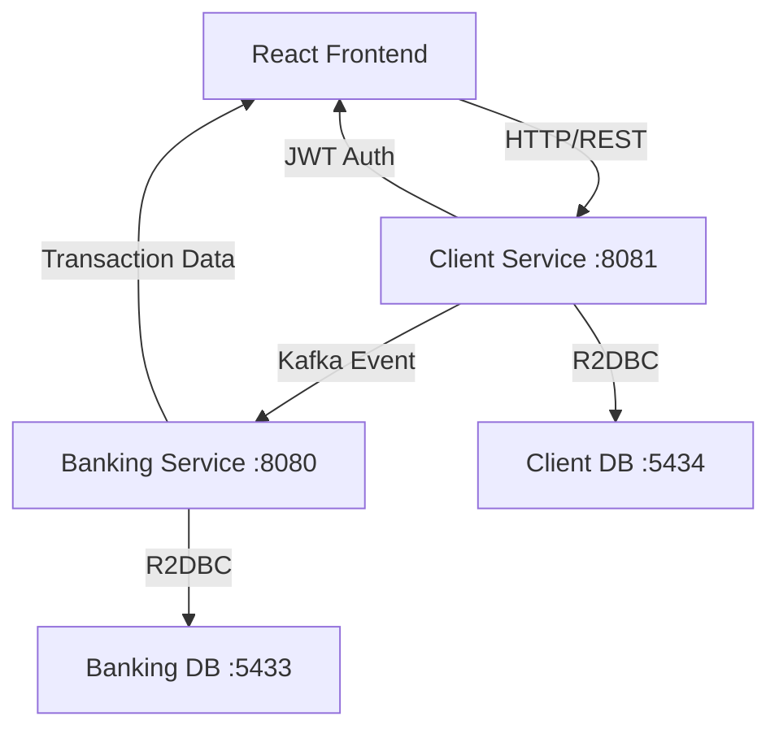

# SecureBank - Microservice Banking Platform

A full-stack microservice banking platform built with Spring Boot WebFlux (reactive programming) and React Router, featuring real-time transaction processing, user management, and admin controls.

## 🏗️ Architecture Overview

This application follows a microservices architecture with the following components:

```
├── client/                 # React Router frontend application
├── services/
│   ├── client/            # User management & authentication service
│   └── banking/           # Banking operations & transaction service
└── docker-compose.yml     # Infrastructure orchestration
```

## 🚀 Why WebFlux Over Traditional Servlet Applications?

We chose **Spring WebFlux** (reactive programming) over traditional servlet-based applications for several key reasons:

### 1. **Non-blocking I/O & Better Resource Utilization**
- Traditional servlet applications use one thread per request, which can lead to thread pool exhaustion under high load
- WebFlux uses an event-loop model with a small number of threads, handling thousands of concurrent requests efficiently
- Perfect for I/O-intensive banking operations (database queries, external API calls)

### 2. **Reactive Streams & Backpressure**
- Built-in backpressure handling prevents system overload
- Reactive streams allow for better handling of data flows between services
- Essential for real-time transaction processing and notifications

### 3. **Better Scalability**
- Lower memory footprint per request
- Can handle more concurrent users with fewer resources
- Ideal for cloud deployments and horizontal scaling

### 4. **Integration with Reactive Ecosystem**
- **R2DBC**: Reactive database connectivity for PostgreSQL
- **Reactor Kafka**: Reactive Kafka integration for event streaming
- **WebClient**: Non-blocking HTTP client for service-to-service communication

### 5. **Real-time Capabilities**
- Better suited for real-time features like live transaction updates
- Efficient handling of streaming data and server-sent events

## 🛠️ Technology Stack

### Backend Services
- **Spring Boot 3.5.4** with **WebFlux** (Reactive Programming)
- **R2DBC** with **PostgreSQL** (Reactive Database Access)
- **Apache Kafka** (Event Streaming & Microservice Communication)
- **Spring Security** with **JWT** (Authentication & Authorization)
- **Docker & Docker Compose** (Containerization)

### Frontend
- **React Router 7** (SPA Framework)
- **TypeScript** (Type Safety)
- **Tailwind CSS** (Styling)
- **Formik & Yup** (Form Handling & Validation)
- **Axios** (HTTP Client)

### Infrastructure
- **PostgreSQL** (Primary Database)
- **Apache Kafka** (Message Broker)
- **Docker** (Containerization)

 ur## 🏃‍♂️ Quick Start

### Prerequisites
- Docker & Docker Compose
- Node.js 20+ (for frontend development)
- Java 21+ (for backend development)

### 1. Start the Complete Application
```bash
# Clone the repository
git clone <repository-url>
cd microbank

# Start all services with Docker Compose
docker-compose up --build

# The application will be available at:
# - Frontend: http://localhost:5173
# - Client Service: http://localhost:8081
# - Banking Service: http://localhost:8080
```

### 2. Development Mode

#### Backend Services
```bash
# Start infrastructure (databases + kafka)
docker-compose up client_db banking_db kafka

# Run client service
cd services/client
./mvnw spring-boot:run

# Run banking service (in another terminal)
cd services/banking
./mvnw spring-boot:run
```

### API END POINTS FOR BACKEND SERVICES:
[Banking Service](http://13.59.11.243.sslip.io/banking/swagger-ui/index.html)
[Client Service](http://13.59.11.243.sslip.io/client/swagger-ui/index.html)

#### Frontend
```bash
cd client
npm install
npm run dev
```

## 🧪 Running Tests

### Backend Tests
```bash
# Client service tests
cd services/client
./mvnw test

# Banking service tests
cd services/banking
./mvnw test

# Run tests with coverage
./mvnw test jacoco:report
```

### Frontend Tests
```bash
cd client
npm test
```

## 📊 Service Communication Flow



## 🔐 Authentication Flow

1. User registers/logs in through the frontend
2. Client service validates credentials and generates JWT token
3. Client service publishes "user-created" event to Kafka
4. Banking service consumes the event and creates a bank account
5. All subsequent requests include JWT token for authentication
6. Admin users have additional privileges for user management

## 🏦 Core Features

### User Management
- User registration and authentication
- JWT-based security
- Role-based access control (USER/ADMIN)
- User blacklisting capabilities

### Banking Operations
- Account creation (automatic via Kafka events)
- Deposit and withdrawal transactions
- Transaction history
- Real-time balance updates

### Admin Panel
- User management dashboard
- Account blocking/unblocking
- System-wide statistics
- Transaction monitoring

## 🌐 API Endpoints

### Client Service (Port 8081)
- `POST /api/v1/auth/register` - User registration
- `POST /api/v1/auth/login` - User login
- `GET /api/v1/users/current-user` - Get current user
- `GET /api/v1/users/admin` - Admin: Get all users

### Banking Service (Port 8080)
- `GET /api/v1/bank-accounts/{userId}` - Get account by user ID
- `PATCH /api/v1/bank-accounts/{id}/deposit` - Deposit funds
- `PATCH /api/v1/bank-accounts/{id}/withdraw` - Withdraw funds
- `GET /api/v1/bank-accounts/{id}/transactions` - Get transaction history

## 🔧 Environment Variables

Create a `.env` file in the root directory:

```env
# Database Configuration
CLIENT_POSTGRES_USER=client_user
CLIENT_POSTGRES_PASSWORD=client_password
CLIENT_POSTGRES_DB=client_db

BANKING_POSTGRES_USER=banking_user
BANKING_POSTGRES_PASSWORD=banking_password
BANKING_POSTGRES_DB=banking_db

# JWT Configuration
JWT_SECRET=your-super-secret-jwt-key-here

# Kafka Configuration
KAFKA_NODE_ID=1
KAFKA_PROCESS_ROLES=broker,controller
KAFKA_CONTROLLER_QUORUM_VOTERS=1@kafka:9093
KAFKA_LISTENERS=PLAINTEXT://0.0.0.0:9092,CONTROLLER://0.0.0.0:9093
KAFKA_ADVERTISED_LISTENERS=PLAINTEXT://localhost:9092
KAFKA_LISTENER_SECURITY_PROTOCOL_MAP=PLAINTEXT:PLAINTEXT,CONTROLLER:PLAINTEXT
KAFKA_CONTROLLER_LISTENER_NAMES=CONTROLLER
KAFKA_INTER_BROKER_LISTENER_NAME=PLAINTEXT
KAFKA_OFFSETS_TOPIC_REPLICATION_FACTOR=1
SPRING_KAFKA_BOOTSTRAP_SERVERS=kafka:9092
```

## 📁 Project Structure

```
microbank/
├── client/                          # React frontend application
├── services/
│   ├── client/                      # User management microservice
│   │   ├── src/main/java/com/microbank/client/
│   │   │   ├── controllers/         # REST controllers
│   │   │   ├── services/           # Business logic
│   │   │   ├── repository/         # Data access layer
│   │   │   ├── entity/             # JPA entities
│   │   │   ├── config/             # Configuration classes
│   │   │   └── utils/              # Utility classes
│   │   └── src/main/resources/
│   │       ├── application.yml     # Application configuration
│   │       └── schema.sql          # Database schema
│   └── banking/                     # Banking operations microservice
│       └── [similar structure to client service]
├── docker-compose.yml               # Multi-service orchestration
└── .github/workflows/               # CI/CD pipeline
```

## 🚀 Deployment

The application includes a GitHub Actions workflow for automated deployment. The pipeline:

1. Builds and tests all services
2. Creates Docker images
3. Deploys to production server via SSH
4. Runs database migrations
5. Starts services with zero downtime

## 🤝 Contributing

1. Fork the repository
2. Create a feature branch (`git checkout -b feature/amazing-feature`)
3. Commit your changes (`git commit -m 'Add some amazing feature'`)
4. Push to the branch (`git push origin feature/amazing-feature`)
5. Open a Pull Request

## 📝 License

This project is licensed under the MIT License - see the [LICENSE](LICENSE) file for details.

## 🆘 Troubleshooting

### Common Issues

1. **Port conflicts**: Ensure ports 5173, 8080, 8081, 5432, 5433, 9092 are available
2. **Database connection issues**: Check if PostgreSQL containers are running
3. **Kafka connection issues**: Ensure Kafka container is healthy before starting services
4. **JWT token issues**: Verify JWT_SECRET environment variable is set

### Logs
```bash
# View service logs
docker-compose logs client-service
docker-compose logs banking-service

# View all logs
docker-compose logs -f
```


### nginx configurations
```
server {
        listen 443 ssl;
        server_name _;

        ssl_certificate /etc/nginx/ssl/server.crt;
        ssl_certificate_key /etc/nginx/ssl/server.key

        location /client/ {
                proxy_pass http://127.0.0.1:8081/;
                proxy_set_header Host $host;
                proxy_set_header X-Real-IP $remote_addr;
                proxy_set_header X-Forwarded-For $proxy_add_x_forwarded_for;
                proxy_set_header X-Forwarded-Proto $scheme;
        }

        location /banking/ {
                proxy_pass http://127.0.0.1:8080/;
                proxy_set_header Host $host;
                proxy_set_header X-Real-IP $remote_addr;
                proxy_set_header X-Forwarded-For $proxy_add_x_forwarded_for;
                proxy_set_header X-Forwarded-Proto $scheme;
        }

        location /frontend/ {
                proxy_pass http://127.0.0.1:3000/;
                proxy_set_header Host $host;
                proxy_set_header X-Real-IP $remote_addr;
                proxy_set_header X-Forwarded-For $proxy_add_x_forwarded_for;
                proxy_set_header X-Forwarded-Proto $scheme;
        }

}
```